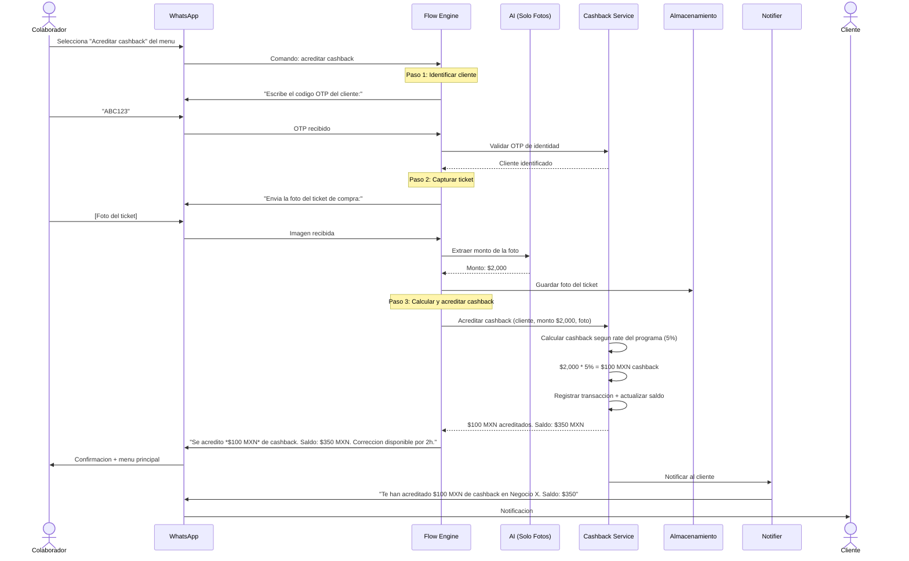
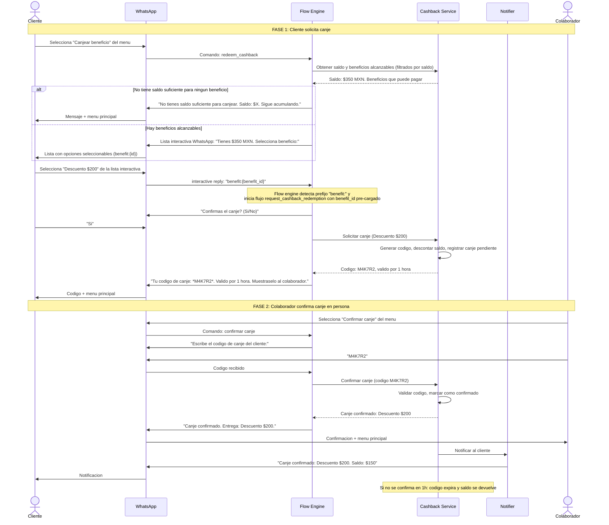
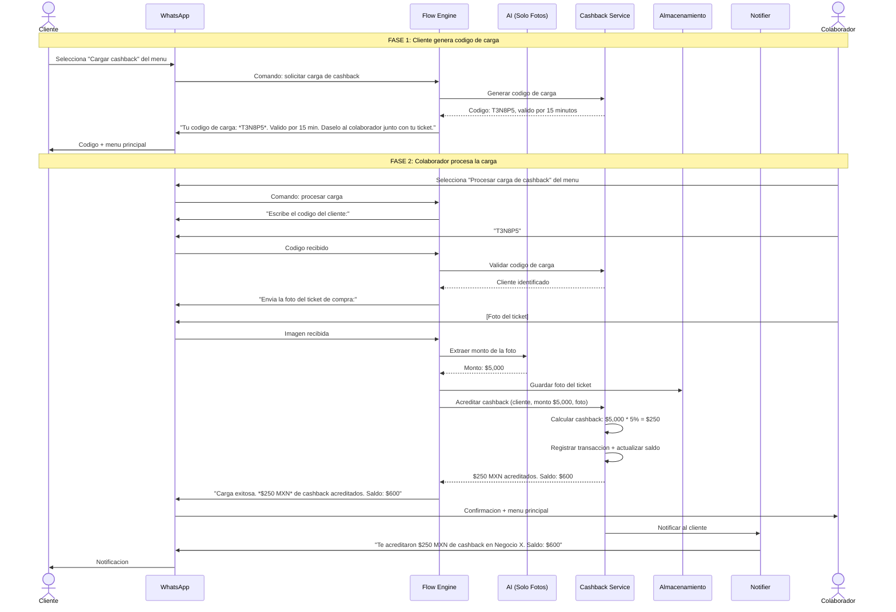
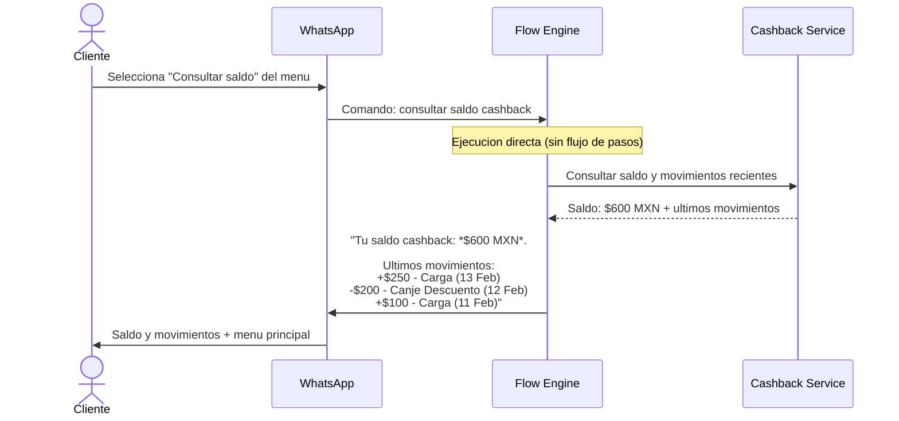
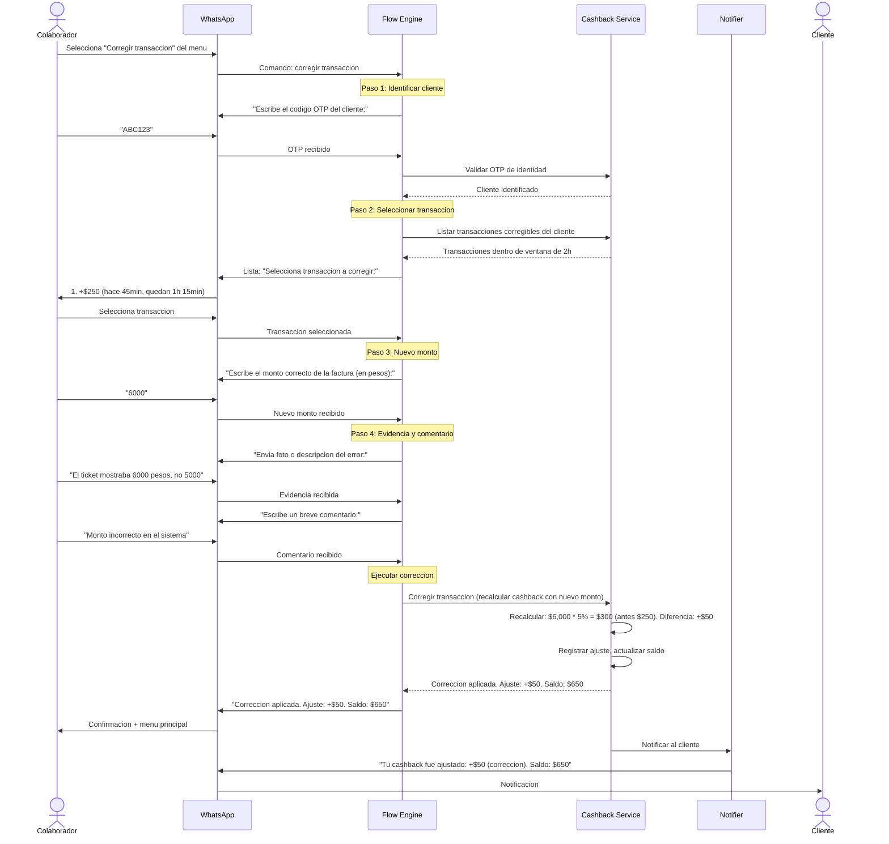
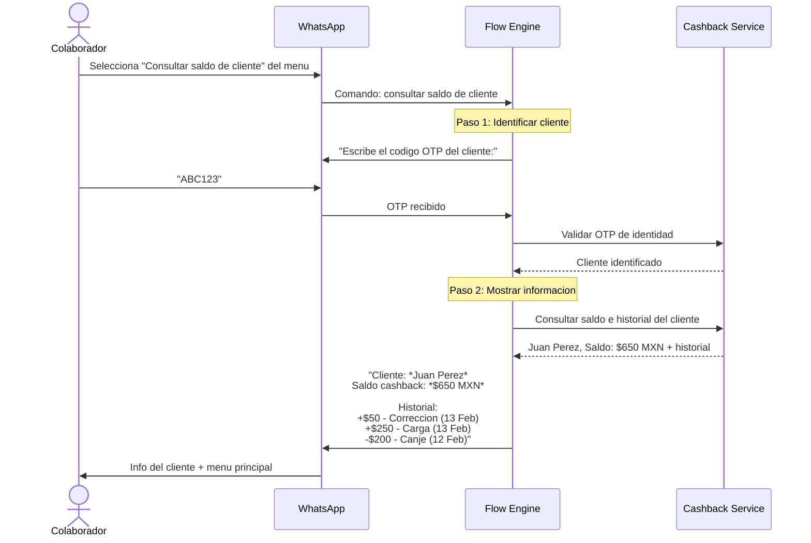
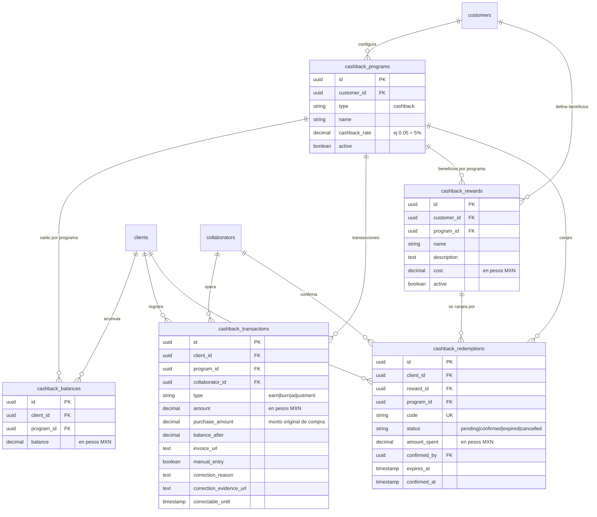

# Cashback: Diagramas de Flujo y Componentes

---

## 1. Diagrama de Componentes del Modulo

```mermaid
graph TB
    subgraph CashbackModule["Modulo Cashback (aislado)"]
        CB_MENUS["Menus + Flows<br/>5 cliente / 5 colaborador"]
        CB_SERVICE["Service<br/>Logica de negocio cashback"]
        CB_REPO["Repository<br/>Interface + Postgres"]
        CB_CACHE["Cache<br/>Interface + Redis"]
        CB_API["API Handlers<br/>→ Service (no SQL directo)"]
    end

    subgraph Shared["Infraestructura Compartida"]
        REGISTRY["Module Registry<br/>(despacha a cashback o earn-burn)"]
        FLOW_ENGINE["Flow Engine<br/>(mismo engine, diferentes flows)"]
        APPERROR["apperror<br/>(mismo manejo de errores)"]
        SESSION["Session Manager<br/>(misma sesion)"]
        WA_CLIENT["WhatsApp Client<br/>(mismo cliente)"]
        RES_REPO["resolver.Repository<br/>(mismos resolvers)"]
    end

    subgraph Storage["Almacenamiento"]
        PG[(PostgreSQL<br/>tablas cashback_*<br/>separadas de earn-burn)]
        REDIS[(Redis<br/>mismos patrones OTP<br/>otp:{code})]
        S3[(MinIO/S3<br/>mismas fotos)]
    end

    REGISTRY --> CB_MENUS
    FLOW_ENGINE --> REGISTRY
    CB_MENUS --> CB_SERVICE
    CB_SERVICE --> CB_REPO --> PG
    CB_SERVICE --> CB_CACHE --> REDIS
    CB_SERVICE --> S3
    CB_API --> CB_SERVICE
    APPERROR -.->|clasifica errores| CB_SERVICE
```

**Nota:** El modulo cashback es completamente independiente de earn-burn. Comparten infraestructura (WhatsApp, Redis, resolvers, flow engine) pero tienen:
- Tablas de DB separadas (`cashback_balances`, `cashback_transactions`, `cashback_rewards`, `cashback_redemptions`)
- Service, Repository y Cache propios
- Menus y flows propios registrados en el Registry
- API handlers propios

---

## 2. Flujo: Acreditar Cashback (Colaborador)



---

## 3. Flujo: Canje de Beneficio (Cliente + Colaborador)



---

## 4. Flujo: Carga de Cashback (Cliente + Colaborador)



---

## 5. Flujo: Consultar Saldo (Cliente)



---

## 6. Flujo: Correccion de Cashback (Colaborador, ventana 2h)



---

## 7. Flujo: Consultar Saldo de Cliente (Colaborador)



---

## 8. Diagrama de Datos (ER Cashback)



**Diferencias clave con earn-burn:**
- `cashback_programs.cashback_rate` (decimal, ej: 0.05) en lugar de `programs.points_ratio` (integer)
- `cashback_balances.balance` es `DECIMAL(12,2)` (pesos) en lugar de `INTEGER` (puntos)
- `cashback_transactions.amount` es `DECIMAL(12,2)` (pesos) en lugar de `INTEGER` (puntos)
- `cashback_transactions.purchase_amount` almacena el monto original de la compra para auditoria
- `cashback_rewards.cost` es `DECIMAL(12,2)` (pesos) en lugar de `INTEGER` (puntos)
- Todas las tablas tienen prefijo `cashback_` para aislamiento total

**Tablas compartidas (no se duplican):**
- `customers` — el negocio B2B
- `clients` — el usuario final
- `collaborators` — los empleados
- `feedback` — ya es por customer_id, sirve para ambos modulos
