# Earn-Burn: Diagramas de Flujo y Componentes

---

## 1. Diagrama General de Componentes

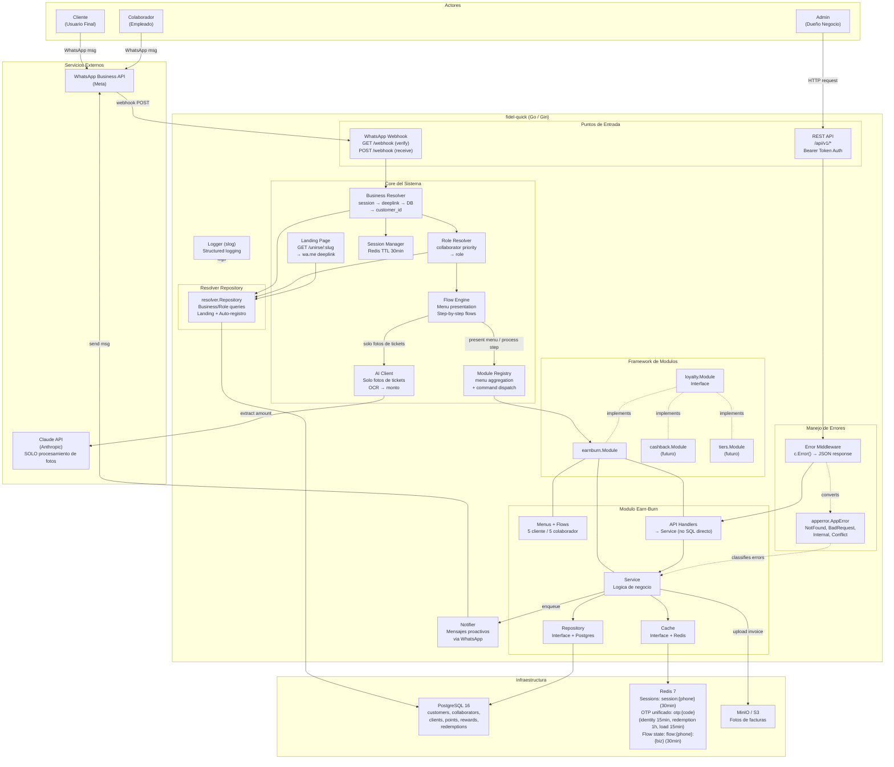

---

## 2. Flujo General: Mensaje Entrante

Flujo completo desde que un usuario envia un mensaje hasta que recibe respuesta. Cubre resolucion de contexto, sesion, y procesamiento.

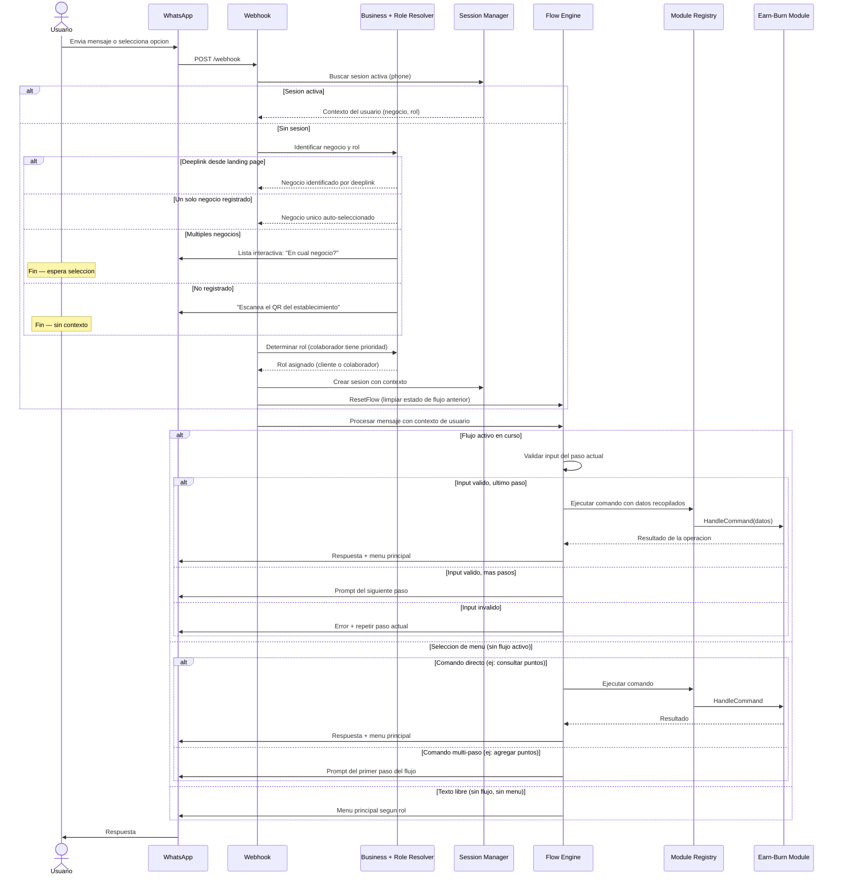

---

## 3. Flujo: Agregar Puntos (Colaborador)

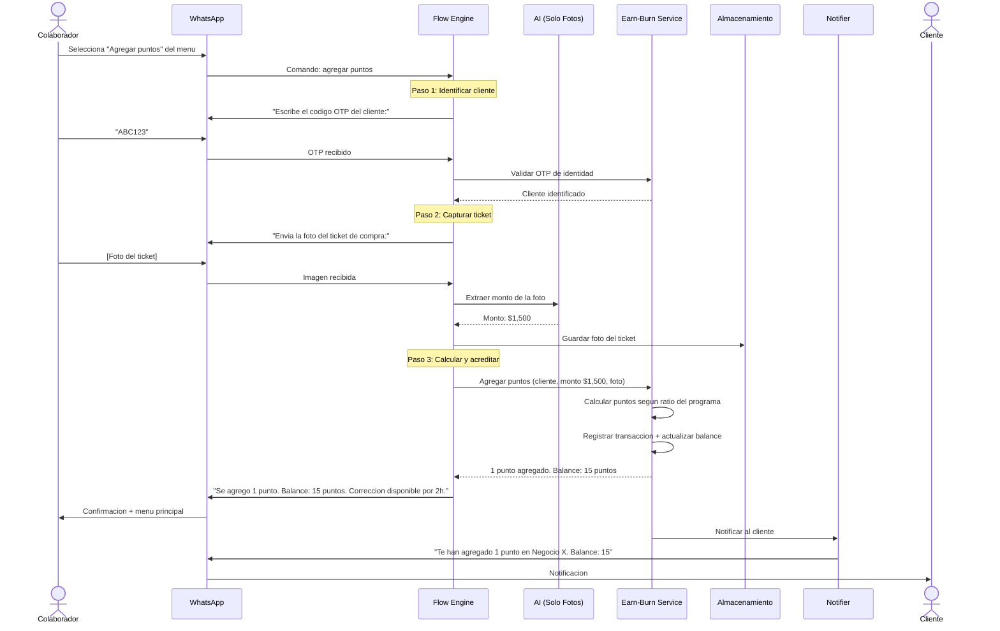

---

## 4. Flujo: Canje de Recompensa (Cliente + Colaborador)

Flujo completo en dos fases: el cliente solicita el canje y recibe un codigo, luego el colaborador lo confirma en persona.

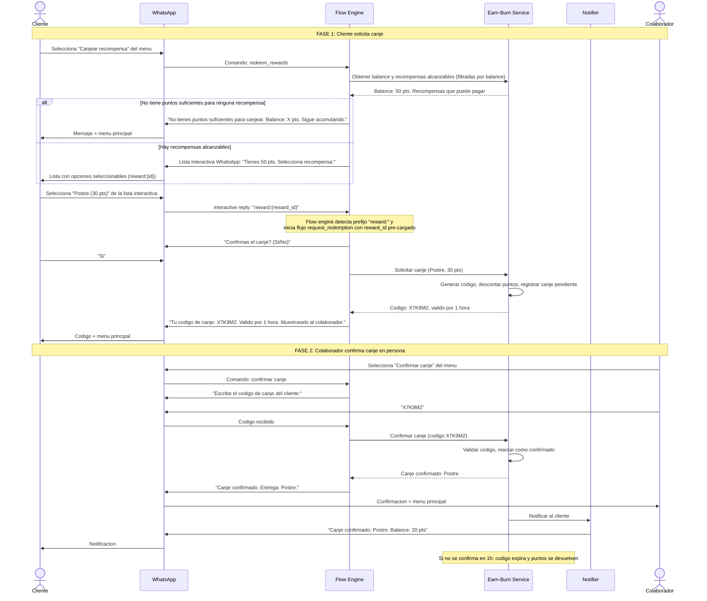

---

## 5. Flujo: Carga de Puntos (Cliente + Colaborador)

Flujo completo en dos fases: el cliente genera un codigo temporal y se lo da al colaborador junto con su ticket.

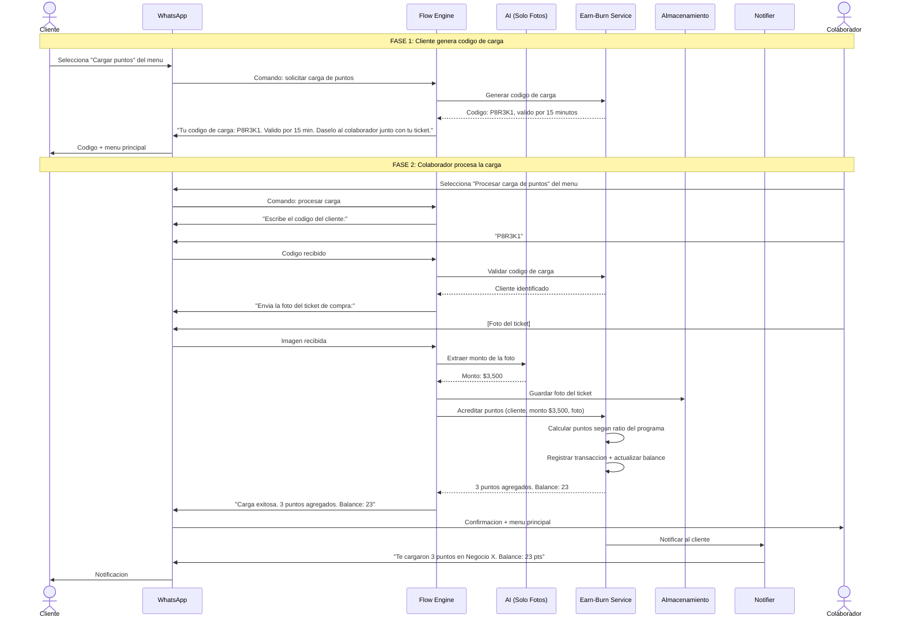

---

## 6. Flujo: Consultar Puntos (Cliente)

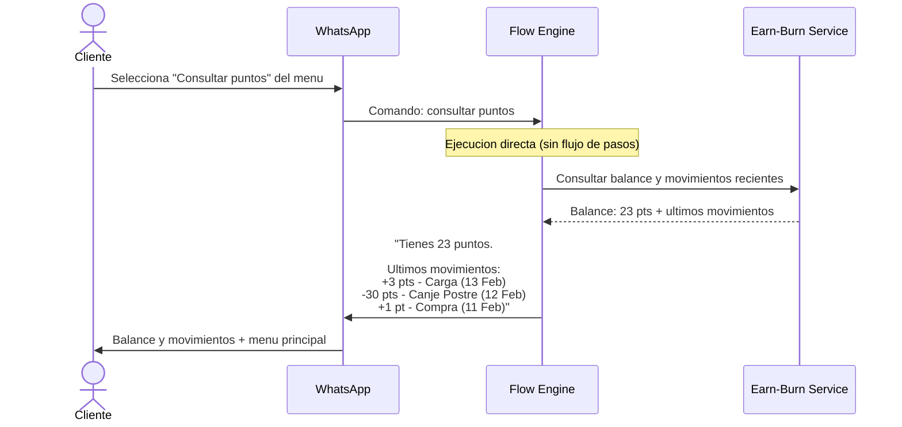

---

## 7. Flujo: Correccion de Puntos (Colaborador, ventana 2h)

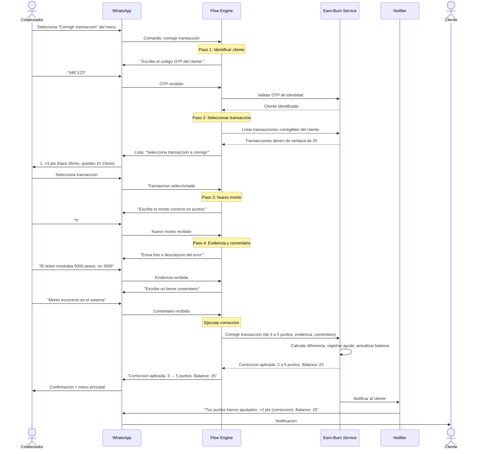

---

## 8. Flujo: Consultar Puntos de Cliente (Colaborador)

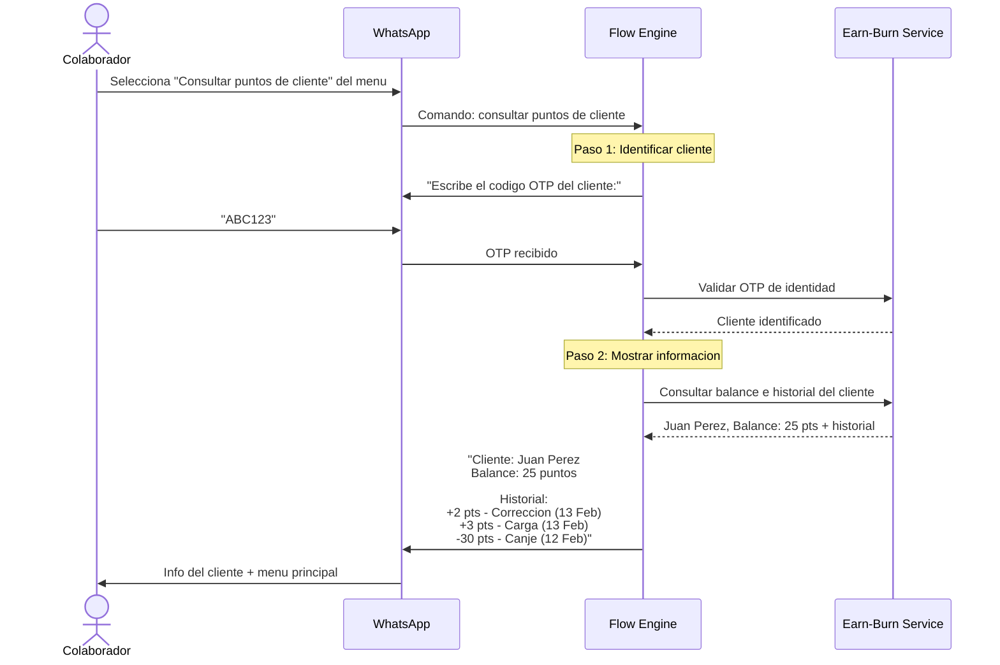

---

## 9. Diagrama de Componentes Internos (Capas)

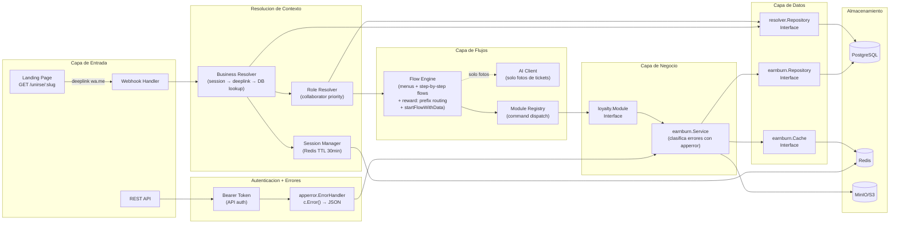

---

## 10. Diagrama de Datos (ER Simplificado)

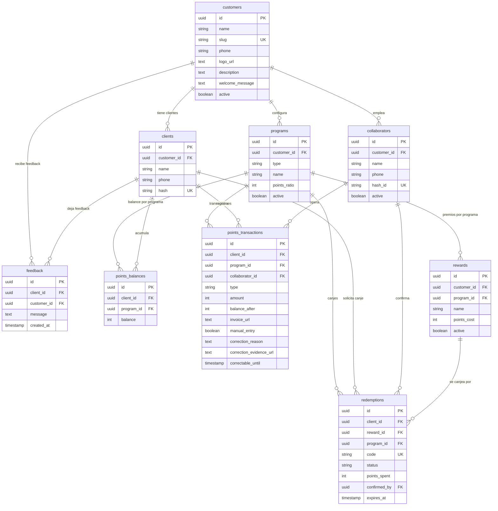

---

## 11. Estrategia Hybrid TTL — Sistema OTP Unificado (Redis + Postgres)

```mermaid
graph TB
    subgraph Unified["Sistema OTP Unificado"]
        U0["Todos los codigos: otp:{code}<br/>→ {client_id, customer_id, type, metadata}"]
        U1["type=identity → TTL 15min, GET (multi-uso)"]
        U2["type=redemption → TTL 1h, GETDEL (un solo uso)"]
        U3["type=load_points → TTL 15min, GETDEL (un solo uso)"]
        U0 --- U1
        U0 --- U2
        U0 --- U3
    end

    subgraph Write["Escritura (Generacion de codigo)"]
        W1["1. Generar codigo 6 chars<br/>crypto/rand"]
        W2["2. SET Redis otp:{code}<br/>{client_id, customer_id, type, metadata}<br/>TTL segun type"]
        W3["3. Solo type=redemption:<br/>INSERT Postgres redemptions<br/>expires_at = NOW() + 1h"]
        W1 --> W2 --> W3
    end

    subgraph ReadIdentity["Lectura: type=identity"]
        RI1["GET otp:{code}"]
        RI2{Existe y type==identity?}
        RI3["→ client_id resuelto"]
        RI4["Invalido o expirado"]
        RI1 --> RI2
        RI2 -->|Si| RI3
        RI2 -->|No| RI4
    end

    subgraph ReadSingleUse["Lectura: type=redemption|load_points"]
        RS1["GETDEL otp:{code}"]
        RS2{Existe y type correcto?}
        RS3["Codigo valido<br/>→ Procesar"]
        RS4["Fallback Postgres<br/>(solo redemption)"]
        RS5{Existe y no expirado?}
        RS6["Codigo valido<br/>→ Procesar"]
        RS7["Codigo invalido<br/>o expirado"]
        RS1 --> RS2
        RS2 -->|Si| RS3
        RS2 -->|No| RS4
        RS4 --> RS5
        RS5 -->|Si| RS6
        RS5 -->|No| RS7
    end

    subgraph Expiration["Expiracion"]
        E1["Redis: auto-expire<br/>via TTL sobre otp:{code}"]
        E2["Postgres: periodic job<br/>UPDATE status = 'expired'<br/>WHERE expires_at < NOW()<br/>AND status = 'pending'"]
        E3["Devolver puntos<br/>al balance del cliente<br/>(solo type=redemption)"]
        E2 --> E3
    end

    subgraph Identity["Invalidacion type=identity"]
        ID1["otp:active:{client_id} → code"]
        ID2["Al generar nuevo:<br/>DEL otp:{old_code}<br/>DEL otp:active:{client_id}<br/>SET nuevos keys"]
        ID1 --> ID2
    end
```

---

## 12. Flujo: Registro y Primer Contacto

Flujo unificado con los 4 escenarios posibles cuando un usuario contacta al sistema.

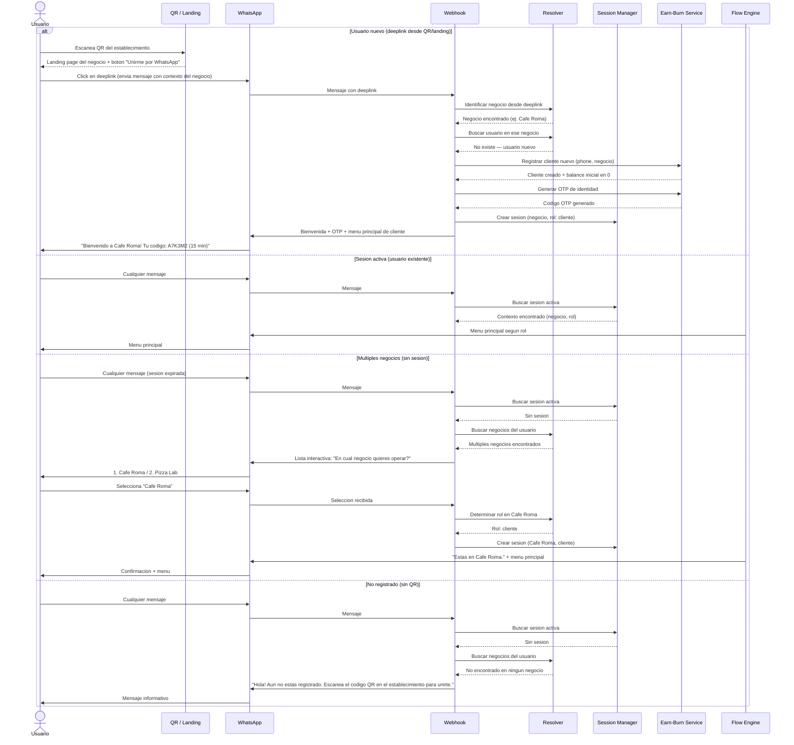
